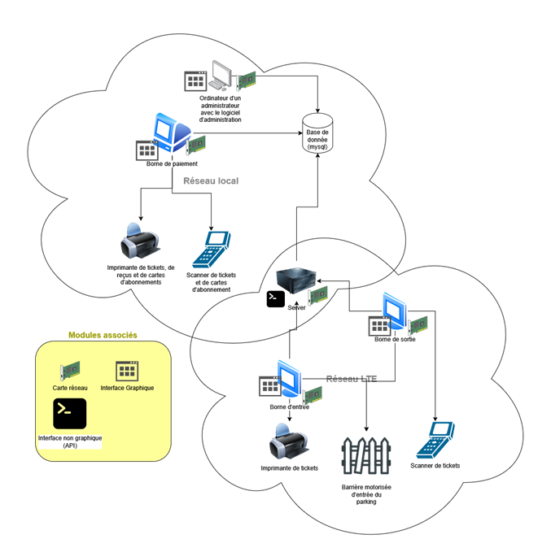

# Best Tickets - Parking Management System


## Table of Contents
- [Project Overview](#project-overview)
- [System Architecture](#system-architecture)
- [Components](#components)
- [Setup Instructions](#setup-instructions)
- [Features](#features)
- [Security](#security)
- [User Roles & Permissions](#user-roles--permissions)
- [Troubleshooting](#troubleshooting)
- [Technologies Used](#technologies-used)
- [License](#license)
- [Authors](#authors)

## Project Overview

Best Tickets is a comprehensive parking management system designed primarily for hospitals and other facilities requiring efficient parking ticket handling. The system enables ticket creation, payment processing, subscription management, gate control, and administrative oversight through a suite of interconnected applications.

## System Architecture

The system consists of five main components:

1. **Admin Software** - A central management application for system administrators (.NET 6.0)
2. **Payment Terminal** - Customer-facing interface for processing ticket payments (.NET 6.0)
3. **Gates Software** - Controls entry and exit gates (.NET 9.0)
4. **Ticket Library** - Shared component library (.NET 6.0)
5. **Ticket Server** - API backend handling data operations (Python/Flask)



The system uses a MySQL database for data storage, with connection strings configured in appsettings.json files.

## Components

### Admin Software

A desktop WPF application built with .NET 6.0 that provides administrators with:

- **Dashboard** - Visualization of parking data using LiveCharts
- **Ticket Management** - View and manage active tickets
- **Hospital Registration** - Add and configure hospital facilities
- **User Management** - Create and manage user accounts with role-based permissions
- **Discount Code Management** - Create and track promotional codes 
- **Subscription Management** - Configure and manage subscription plans and users
- **Price Bracket Configuration** - Set up time-based pricing structures
- **Tax Management** - Configure and track tax rates
- **Gate Control** - Control entry/exit gates

### Payment Terminal

A customer-facing WPF application that allows users to:

- Input ticket information
- Process payments for single-use tickets
- Manage subscription cards and payments
- Print receipts and tickets

### Gates Software

A .NET 9.0 WPF application that:

- Controls physical entry and exit gates
- Validates tickets and subscriptions
- Interfaces with the server API to authenticate access
- Provides real-time gate status monitoring

### Ticket Library

A shared .NET library that contains:

- Core data models and entities
- PDF generation using QuestPDF
- Barcode generation with ZXing.Net
- Shared business logic

### Ticket Server

A Python Flask API backend that provides:

- Authentication and authorization
- Ticket creation and validation
- Gate signal management
- Hospital listing and verification
- RESTful endpoints for client applications

## Setup Instructions

### Prerequisites

- .NET 6.0 SDK (for admin software, payment terminal, ticket library)
- .NET 9.0 SDK (for gates software)
- Python 3.x with pip (for ticket server)
- MySQL Server 5.7+ or compatible
- Visual Studio 2022 or later (recommended for development)

### Database Setup

1. Create a MySQL database named `best-tickets`
2. Configure connection strings in:
   - `admin-software/appsettings.json`
   - `payment-terminal/appsettings.json`
   - Update `DATABASE_URI` in `ticket-server/main.py`
3. Navigate to the admin-software directory and apply database migrations:
   ```
   dotnet ef database update
   ```
   This will create all required database tables and schema.

### Server Setup

1. Navigate to the ticket-server directory
2. Install Python dependencies:
   ```
   python -m pip install -r requirements.txt
   ```
3. Run the server:
   ```
   python main.py
   ```
4. The server will be available at http://localhost:5000
5. The server port can be changed at the end of `main.py`

### Client Applications Setup

1. Open the solution file `best-tickets.sln` in Visual Studio
2. Restore NuGet packages
3. Build the solution
4. Run the desired application(s)

### Gates Software Setup

#### Prerequisites
- .NET 9.0 SDK or later
- Visual Studio 2022 or compatible IDE
- Network connectivity to the Ticket Server API
- Physical gate hardware (or simulation software) compatible with the system

#### Installation Steps
1. Navigate to the `gates-software` directory
2. Build the project using Visual Studio or via command line:
   ```
   dotnet build
   ```
3. Run the application:
   ```
   dotnet run
   ```
   
   Or build a standalone executable:
   ```
   dotnet publish -c Release -r win-x64 --self-contained true
   ```

#### Configuration
1. **Environment Variables**: 
   - Create or update the `.env` file in the application directory with:
     ```
     API_BASE_URL=http://your-server-address:port
     ```

2. **First-Time Setup**:
   - On first launch, the application will present a setup wizard
   - Select your hospital from the dropdown list
   - Enter the hospital gateway password provided by your system administrator
   - Choose the gate type (entry or exit) depending on the installation location
   - The configuration will be stored in `settings.json` and loaded automatically on subsequent launches

## Features

### Ticket Management

- QR-code based ticket generation
- Multiple payment options
- Time-based pricing with customizable brackets
- Detailed ticket tracking and reporting

### Subscription System

- Subscription tiers with different durations and pricing
- Card-based subscriber identification
- Usage tracking and limitations

### Gate Control

- Automated entry gate management
- Exit validation based on payment status
- Gate status logging and alerts

### Reporting & Analytics

- Financial reporting with revenue breakdown
- Usage statistics and trends visualization
- Tax calculation and reporting

### Tax Management

- Configure tax rates
- Automatic tax calculation on tickets
- Tax reporting and summaries
- Support for multiple tax categories

### Hospital Management

- Multi-facility support
- Hospital-specific configurations
- Customizable pricing per facility

## Security

### Authentication & Authorization

- Access control
- Secure password storage using PBKDF2
- Session management and timeout controls

### Initial Login

The system is initialized with a default administrator account:
- **Username**: admin
- **Password**: admin

⚠️ **IMPORTANT**: For security reasons, you should immediately delete this default account or change its credentials after logging in for the first time.

### Security Best Practices

- Keep the gateway password secure
- Regularly rotate credentials
- Limit physical access to terminal computers
- Implement network security measures for all components

## Troubleshooting

### Common Issues

#### Database Connection Problems
- Verify connection strings in appsettings.json files
- Ensure MySQL server is running and accessible

#### Gate Control Issues
- Verify physical connections to gate hardware
- Check network connectivity to server
- Ensure proper credentials in configuration

#### Payment Processing Failures
- Verify payment terminal network connectivity
- Check payment gateway configuration
- Ensure proper permissions are set

#### Server API Errors
- Check server logs in the ticket-server directory
- Verify server is running and accessible
- Check for Python dependency issues

## Technologies Used

### Frontend
- WPF with .NET 6.0 and .NET 9.0
- MaterialDesignThemes for UI
- CommunityToolkit.Mvvm for MVVM pattern
- LiveCharts for data visualization

### Backend
- Flask (Python) for API
- Entity Framework Core for ORM
- SQLAlchemy (Python)

### Database
- MySQL

### Others
- QuestPDF for document generation
- ZXing.Net for barcode handling
- PBKDF2 for password security

## License

Apache License Version 2.0, January 2004, see the LICENSE file for more details.

## Authors

Jeremy Guerin - https://github.com/jere344

---

*This README was last updated in March 2025*